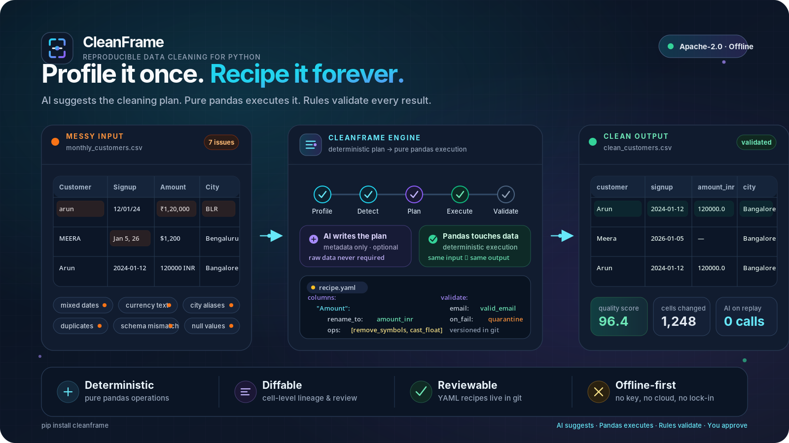

<p align="center">
  
</p>

<h1 align="center">CleanFrame</h1>

<p align="center">
  <b>The reproducible data-cleaning engine for Python.</b><br/>
  AI writes the cleaning recipe once. The recipe runs forever — deterministic, diffable, reviewable.
</p>

<p align="center">
  
</p>

<p align="center">
  <a href="#"></a>
  <a href="#"></a>
  <a href="#"></a>
  <a href="#"></a>
</p>

---

Every team has that file. The vendor spreadsheet that arrives monthly with dates in three formats. The CRM export where `Bengaluru`, `Bangalore`, and `BLR` are three different cities. The finance sheet with `₹1,20,000` in a column typed as text.

You clean it by hand. Next month, it arrives broken in a new way, and you clean it again.

**CleanFrame ends that loop.** It profiles your data, detects issues, proposes a cleanup plan (with an LLM's help — or without one), executes it with pure pandas, and saves the whole thing as a **recipe**: a versionable YAML file that replays on every future file with **zero AI calls**, and alerts you when the incoming schema drifts.

```
AI suggests.  Pandas executes.  Rules validate.  You approve.  Everything is reproducible.
```

## Why not just use an LLM agent on my dataframe?

Because you can't ship "the model probably fixed it" to production. Chat-with-your-data tools are great for exploration and say so themselves — they are not built for pipelines. CleanFrame is built on one rule:

> **The LLM never touches your data. It only writes the plan.**

The plan compiles to deterministic pandas operations. Same input → same output, every time. Every changed cell is tracked. Every step is reviewable, reversible, and exportable as plain Python you can read.

## 30-second demo

No API key needed for this:

```bash
pip install cleanframe
cleanframe report examples/messy_customers.csv
```

You get an HTML report: detected issues, quality score, column-by-column diagnosis. Then fix it:

```python
import pandas as pd
import cleanframe as cf

df = pd.read_csv("examples/messy_customers.csv")

result = cf.clean(
    df,
    target_schema="schemas/customer.yaml",   # or infer one: cf.infer_schema(df)
    llm="anthropic/claude-sonnet-4-6",        # optional — omit for rules-only mode
    mode="review",                            # review | auto | strict
)

result.diff.show()                # cell-level before/after, git-diff style
result.recipe.save("customer.recipe.yaml")   # ← the durable artifact
result.code.save("clean_customers.py")       # plain pandas, no cleanframe dependency
clean_df = result.dataframe
```

Next month, the file comes back. No LLM, no tokens, no variance:

```bash
cleanframe apply new_customers.csv --recipe customer.recipe.yaml --out clean.csv
```

If the new file's schema drifted (a renamed column, a new currency format), CleanFrame **stops and tells you** instead of silently corrupting data:

```
⚠ Schema drift detected in new_customers.csv
  • Column "Amt (INR)" is new — 94% match to recipe column "amount_inr"
  • 312 values in "signup_date" match no allowed date format (new: "Jan 5, 26")
  Run `cleanframe suggest new_customers.csv --recipe customer.recipe.yaml --update` to review a patch.
```

## Bring your own API key (or no key at all)

CleanFrame is LLM-optional and provider-agnostic.

| Mode | What runs | Data leaves your machine? |
|---|---|---|
| **Rules-only** (default) | Deterministic detectors + heuristics | Never |
| **Metadata** | LLM sees column names, dtypes, and *value patterns* (regex sketches) — never raw values | Only metadata |
| **Sample** | LLM sees an anonymized, shuffled sample you approve | Only the approved sample |
| **Replay** | Saved recipes | Never — recipes need no LLM |

- Keys come from environment variables (`ANTHROPIC_API_KEY`, `OPENAI_API_KEY`,
  `OPENROUTER_API_KEY`, `GROQ_API_KEY`, …). CleanFrame never stores, logs, or
  transmits them.
- Any provider that speaks OpenAI Chat Completions works out of the box —
  Anthropic (native), OpenAI, OpenRouter, Groq, Together, Fireworks, DeepSeek,
  Mistral, Google Gemini, xAI, Perplexity, Cohere, plus local Ollama / LM Studio
  or any custom `OPENAI_BASE_URL`. Spec format: `provider/model`
  (e.g. `openrouter/anthropic/claude-sonnet-4`, `groq/llama-3.3-70b-versatile`).
- Hard cost cap: `cf.clean(..., max_tokens_budget=50_000)` aborts planning before it gets expensive.
- Fully offline / air-gapped operation is a supported first-class mode, not a degraded one.

## What it cleans

| Problem | Example |
|---|---|
| Column name chaos | `Cust Name`, `customer_name`, `CustomerName` → `customer_name` |
| Date formats | `12/01/24`, `1 Jan 2024`, `2024-01-01` → ISO dates |
| Currency & numbers | `₹1,20,000`, `$1,200`, `1200 INR` → typed floats + currency column |
| Category variants | `Bengaluru` / `Bangalore` / `BLR` → one canonical value |
| Emails & phones | validation, normalization, country codes |
| Duplicates | exact + fuzzy matching with reviewable merge proposals |
| Missing values | detected and explained; strategies proposed, never silently applied |
| Units | `5kg`, `5000 g`, `5 KG` → normalized |
| Schema mapping | messy file → your target schema, with confidence scores |
| Outliers | flagged with evidence — **detected, never auto-"fixed"** |

## The recipe: your durable artifact

```yaml
# customer.recipe.yaml — generated by CleanFrame, edited by you, owned by git
version: 1
source_fingerprint: {columns: 14, hash_sample: "a41f…"}
columns:
  "Customer Name":
    rename_to: customer_name
    ops: [strip_whitespace, title_case]
  "Signup Date":
    rename_to: signup_date
    parse_date: {dayfirst: true, allowed: ["%d/%m/%Y", "%d-%m-%Y", "%Y-%m-%d"]}
  "Amount":
    rename_to: amount_inr
    ops: [{remove_symbols: ["₹", ","]}, {cast: float}]
  "City":
    rename_to: city
    normalize_values: {Bengaluru: Bangalore, BLR: Bangalore, Bombay: Mumbai}
  "Email":
    rename_to: email
    ops: [strip_whitespace, normalize_email]
validate:
  - {column: email, check: valid_email, on_fail: quarantine}
  - {column: amount_inr, check: ">= 0", on_fail: quarantine}
```

Recipes are reviewed in PRs like code, replayed in CI/Airflow/dbt, and exported to [pandera](https://pandera.readthedocs.io) schemas or Great Expectations suites — CleanFrame plays *with* your validation stack, not against it.

## How it compares

| | CleanFrame | PandasAI | Great Expectations / pandera | YData Profiling | OpenRefine | Flatfile / OneSchema |
|---|---|---|---|---|---|---|
| Fixes data (not just reports) | ✅ | ⚠️ ad-hoc | ❌ validates only | ❌ profiles only | ✅ | ✅ |
| Deterministic & reproducible | ✅ recipes | ❌ | ✅ | ✅ | ⚠️ manual | ⚠️ |
| Production pipelines | ✅ | ❌ (exploration tool) | ✅ | ⚠️ | ❌ GUI | ✅ |
| Python-native library + CLI | ✅ | ✅ | ✅ | ✅ | ❌ | ❌ JS widget / SaaS |
| Works with zero LLM / offline | ✅ | ❌ | ✅ | ✅ | ✅ | ⚠️ |
| Cell-level diff & lineage | ✅ | ❌ | ❌ | ❌ | ⚠️ | ⚠️ |
| Schema-drift alerts on re-import | ✅ | ❌ | ⚠️ | ❌ | ❌ | ✅ ($6k+/yr) |
| Free & open source | ✅ Apache-2.0 | ✅ | ✅ | ✅ | ✅ | ❌ |

Use PandasAI to *explore*. Use pandera/GX to *guard*. Use **CleanFrame to fix — repeatably.**

## Architecture

```
CSV / Excel / DataFrame
   │
   ▼
Profiler ─→ Issue Detectors ─→ Planner ──────────→ Recipe (YAML)
             (deterministic)    (rules, or            │
                                LLM-assisted)         ▼
                                              Executor (pure pandas)
                                                      │
                                                      ▼
                                        Validator · Cell-diff · HTML report
```

Detectors are plugins — write your own in ~30 lines:

```python
@cf.detector("iban")
def detect_iban(series: pd.Series) -> cf.Issues: ...
```

## Roadmap

- [x] Profiler, core detectors (dates, currency, categories, dedup, nulls, schema mapping)
- [x] Recipe format v1 + replay + drift detection
- [x] HTML reports, cell-level diff
- [ ] `MessyData-100` public benchmark + leaderboard
- [ ] pandera / GX / dbt exporters
- [ ] Polars backend
- [ ] Recipe registry for teams

## Contributing

The detector plugin system exists so the community owns the long tail of messy-data weirdness. Good first issues are tagged [`good-first-detector`](../../issues). See [CONTRIBUTING.md](CONTRIBUTING.md).

## Sponsoring

CleanFrame is free, Apache-2.0, and will stay that way for individuals — no feature is paywalled for a person with a laptop and a messy CSV. If it saves your team recurring hours, [sponsorship](https://github.com/sponsors/) funds detector coverage, the benchmark, and long-term maintenance.

---

<p align="center"><i>Profile it once. Recipe it forever.</i></p>
